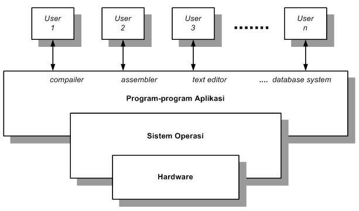

# Konsep Dasar Sistem Operasi

<h4>Pengertian</h4>
Pengertian sistem operasi secara umum ialah pengelola seluruh sumber-daya yang terdapat pada sistem komputer dan menyediakan sekumpulan layanan (system calls) ke pemakai sehingga memudahkan dan menyamankan penggunaan serta pemanfaatan sumber-daya sistem komputer.
Sistem operasi Komputer adalah perangkat lunak komputer atau software yang bertugas untuk melakukan kontrol dan manajemen perangkat keras dan juga operasi-operasi dasar sistem, termasuk menjalankan software aplikasi seperti program-program pengolah data yang bisa digunakan untuk mempermudah kegiatan manusia. <b>Sistem Operasi</b> dalam bahasa Inggrisnya disebut Operating System, atau biasa di singkat dengan OS.
 

<h4>Fungsi dasar</h4>
Sistem komputer pada dasarnya terdiri dari empat komponen utama, yaitu perangkat-keras, program aplikasi, sistem-operasi, dan para pengguna. Sistem operasi berfungsi untuk mengatur dan mengawasi penggunaan perangkat keras oleh berbagai program aplikasi serta para pengguna.
 

<h4>Sejarah Sistem Informasi</h4>
Menurut Tanenbaum, sistem operasi mengalami perkembangan yang sangat pesat, yang dapat dibagi kedalam empat generasi:
 
<ul>
	<li>Generasi Pertama (1945-1955)</li>
		
Generasi pertama merupakan awal perkembangan sistem komputasi elektronik sebagai pengganti sistem komputasi mekanik, hal itu disebabkan kecepatan manusia untuk menghitung terbatas dan manusia sangat mudah untuk membuat kecerobohan, kekeliruan bahkan kesalahan. Pada generasi ini belum ada sistem operasi, maka sistem komputer diberi instruksi yang harus dikerjakan secara langsung.

	<li>Generasi Kedua (1955-1965)</li>
		
Generasi kedua memperkenalkan Batch Processing System, yaitu Job yang dikerjakan dalam satu rangkaian, lalu dieksekusi secara berurutan.Pada generasi ini sistem komputer belum dilengkapi sistem operasi, tetapi beberapa fungsi sistem operasi telah ada, contohnya fungsi sistem operasi ialah FMS dan IBSYS.

	<li>Generasi Ketiga (1965-1980)</li>
		
Pada generasi ini perkembangan sistem operasi dikembangkan untuk melayani banyak pemakai sekaligus, dimana para pemakai interaktif berkomunikasi lewat terminal secara on-line ke komputer, maka sistem operasi menjadi multi-user (di gunakan banyak pengguna sekaligus) dan multi-programming (melayani banyak program sekaligus).

	<li>Generasi Keempat (Pasca 1980an)</li>
		
Dewasa ini, sistem operasi dipergunakan untuk jaringan komputer dimana pemakai menyadari keberadaan komputer-komputer yang saling terhubung satu sama lainnya. Pada masa ini para pengguna juga telah dinyamankan dengan Graphical User Interface yaitu antar-muka komputer yang berbasis grafis yang sangat nyaman, pada masa ini juga dimulai era komputasi tersebar dimana komputasi-komputasi tidak lagi berpusat di satu titik, tetapi dipecah dibanyak komputer sehingga tercapai kinerja yang lebih baik.

</ul>

<h4>Layanan Sistem Operasi</h4>
Sebuah sistem operasi yang baik menurut Tanenbaum harus memiliki layanan sebagai berikut:
 
1. Pembuatan program
	
sistem operasi menyediakan fasilitas dan layanan untuk membantu para pemrogram untuk menulis program

2. Eksekusi program
	
Instruksi-instruksi dan data-data harus dimuat ke memori utama, perangkat-parangkat masukan/ keluaran dan berkas harus di-inisialisasi, serta sumber-daya yang ada harus disiapkan, semua itu harus di tangani oleh sistem operasi

3. Pengaksesan I/O Device
	
Sistem Operasi harus mengambil alih sejumlah instruksi yang rumit dan sinyal kendali menjengkelkan agar pemrogram dapat berfikir sederhana dan perangkat pun dapat beroperasi

4. Pengaksesan terkendali terhadap berkas.
	
Disediakannya mekanisme proteksi terhadap berkas untuk mengendalikan pengaksesan terhadap berkas

5. Pengaksesan sistem
	
Menggunakan prinsip shared system (sistem digunakan bersamaan dalam suatu waktu). Fungsi pengaksesan harus menyediakan proteksi terhadap sejumlah sumber-daya dan data dari pemakai tak terdistorsi serta menyelesaikan konflik-konflik dalam perebutan sumber-daya

6. Deteksi dan pemberian tanggapan pada kesalahan
	
Jika muncul permasalahan muncul pada sistem komputer maka sistem operasi harus memberikan tanggapan yang menjelaskan kesalahan yang terjadi serta dampaknya terhadap aplikasi yang sedang berjalan

7. Akunting
	
Sistem Operasi yang bagus mengumpulkan data statistik penggunaan beragam sumber-daya dan memonitor parameter kinerja.

 
<h4>Struktur Sistem Operasi</h4>
Pendekatan yang umum suatu sistem yang besar dan kompleks adalah dengan memecah tugas-tugas(task) ke bentuk komponen-komponen kecil dibandingkan dalam bentuk sistem tunggal (monolithic). Komponen-komponen tersebut akan akan di bahas pada bagian berikut ini.
 

<h6>a. Struktur Sederhana</h6>

Banyak sistem operasi komersial yang tidak terstruktur dengan baik. Kemudian sistem operasi dimulai dari yang terkecil, sederhana dan terbatas lalu berkembang dengan ruang lingkup originalnya. Contoh dari sistem operasi ini adalah MS-DOS dan UNIX. MS-DOS merupakan sistem operasi yang menyediakan fungsional dalam ruang yang sedikit sehingga tidak dibagi menjadi beberapa modul, sedangkan UNIX menggunakan struktur <b>monolitik</b> dimana prosedur dapat saling dipanggil oleh prosedur lain di sistem bila diperlukan dan kernel berisi semua layanan yang disediakan sistem operasi untuk pengguna. Inisialisasi-nya terbatas pada fungsional perangkat keras yang terbagi menjadi dua bagian yaitu kernel dan sistem program. Kernel terbagi menjadi serangkaian interface dan device driver dan menyediakan sistem file, penjadwalan CPU, manajemen memori, dan fungsi-fungsi sistem operasi lainnya melalui system calls.

 
Kelemahan struktur monolitik adalah:
<ul>
	<li>Pengujian dan penghilangan kesalahan sulit karena tidak dapat dipisahkan dan dialokasikan</li>
	<li>Sulit dalam menyediakan fasilitas pengamanan</li>
	<li>Merupakan pemborosan memori bila setiap komputer harus menjalan kernel monolitik, karena semua layanan tersimpan dalam bentuk tunggal sedangkan tidak semua layanan diperlukan.</li>
	<li>Kesalahahan sebagian fungsi menyebabkan sistem tidak berfungsi.</li>
</ul>
 
Keuntungan struktur monolitik adalah layanan dapat dilakukan dengan cepat karena terdapat dalam satu ruang.
 
<h6>b. Pendekatan Berlapis (Layer Approach)</h6>

Sistem operasi dibagi menjadi beberapa lapisan. Lapisan terbawah (layer 0) adalah hardware dan yang tertinggi (layer N) adalah user interface. Lapisan N memberi layanan untuk lapisan N+1 sedangkan proses-proses di lapisan N dapat meminta layanan lapisan N-1 untuk membangun layanan lapisan N+1. Lapisan N dapat meminta layanan lapisan N-1 namun lapisan N tidak dapat meminta layanan lapisan N+1. Masing-masing berjalan pada lapisannya sendiri.

 
Menurut Tanenbaum dan Woodhull, sistem terlapis terdiri dari enam lapisan, yaitu:
 
1. Lapisan 0. Mengatur alokasi prosesor, pertukaran antar proses ketika interupsi terjadi atau waktu habis dan lapisan ini mendukung dasar multi-programming pada CPU.
2. Lapisan 1. Mengalokasikan ruang untuk proses di memori utama dan pada 512 kilo word drum yang digunakan untuk menahan bagian proses ketika tidak ada ruang di memori utama.
3. Lapisan 2. Menangani komunikasi antara masing-masing proses dan operator console. Lapisan ini masing-masing proses secara efektif memiliki operator console sendiri.
4. Lapisan 3. Mengatur peranti I/O dan menampung informasi yang mengalir dari/ke proses tersebut.
5. Lapisan 4. Tempat program pengguna. Pengguna tidak perlu memikirkan tentang proses, memori, console, atau manajemen I/O.
6. Lapisan 5. Merupakan operator sistem.
 
Contoh sistem operasi yang menggunakan pendekatan berlapis adalah THE yang dibuat oleh Djikstra dan mahasiswa-mahasiswanya, serta sistem operasi MULTICS.
 
Kelemahan struktur ini adalah fungsi-fungsi sistem operasi harus diberikan ke tiap lapisan secara hati-hati. Sedangkan keunggulannya adalah memeliki semua kelebihan rancangan modular, yaitu sistem dibagi menjadi beberapa modul dan tiap modul dirancang secara independen. Tiap lapisan dapat dirancang, dikode dan diuji secara independen. Pendekatan berlapis menyederhanakan rancangan, spesifikasi dan implementasi sistem operasi.
 

<h6>c. Microkernels</h6>

Metode struktur ini adalah menghilangkan komponen-komponen yang tidak diperlukan dari kernel dan mengimplementasikannya sebagai sistem dan program-program level user. Hal ini akan menghasilkan kernel yang kecil. Fungsi utama dari jenis ini adalah menyediakan fasilitas komunikasi antara program client dan bermacam pelayanan yang berjalan pada ruang user. Contoh sistem operasi yang menggunakan metode ini adalah TRU64 UNIX, MacOSX dan QNX.

Keuntungan dari kernel ini adalah kemudahan dalam memperluas sistem operasi, mudah untuk diubah ke bentuk arsitektur baru, kode yang kecil dan lebih aman. Kelemahannya adalah kinerja akan berkurang selagi bertambahnya fungsi-fungsi yang digunakan.

 
<h6>d. Modular (Modules)</h6>

Kernel mempunyai kumpulan komponen-komponen inti dan secara dinamis terhubung pada penambahan layanan selama waktu boot atau waktu berjalan. Sehingga strateginya menggunakan pemanggilan modul secara dinamis (Loadable Kernel Modules). Umumnya sudah diimplementasikan oleh sistem operasi modern seperti Solaris, Linux dan MacOSX.

Sistem Operasi Apple Macintosh Mac OS X menggunakan <b>struktur hybrid</b>. Strukturnya menggunakan teknik berlapis dan satu lapisan diantaranya menggunakan Mach microkernel.

<h6>e. Virtual Machine</h6>

Dalam struktur ini user seakan-akan mempunyai seluruh komputer dengan simulasi atas pemroses yang digunakan. Sistem operasi melakukan simulasi mesin nyata yang digunakan user, mesin virtual ini merupakan tiruan seratus persen atas mesin nyata.

Teknologi ini awalnya digunakan pada IBM S/370. VM/370 menyediakan mesin virtual untuk tiap user dengan membuat mesin virtual baru pada saat user tersebut melakukan log sistem. Kemudian teknik ini berkembang menjadi operating system emulator sehingga sistem operasi dapat menjalankan aplikasi-aplikasi untuk sistem operasi lain.

Dalam lingkungan ini terdapat proteksi berbagai sumber daya sistem. Setiap virtual-machine secara lengkap mengisolasi dari semua virtual-machine yang lain, sehingga tidak ada masalah proteksi. Ada dua pendekatan dalam penyediaan sharing yang diimplementasikan, pertama hal ini memungkinkan share minidisk dan share files. Kedua, memungkinkan pendefinisian jaringan virtual-machine, sehingga dapat mengirim informasi melalui virtual jaringan komunikasi.

 
Contoh dari pengembangan itu adalah sebagai berikut:
<ul>
	<li>Sistem operasi MS-Windows NT dapat menjalankan aplikasi untuk MS-DOS, OS/2 mode teks dan aplikasi WIN16.</li>
	<li>IBM mengembangkan WABI untuk meng-emulasikan Win32 API sehingga sistem operasi yang menjalankan WABI dapat menjalankan aplikasi-aplikasi untuk MS-Windows.</li>
	<li>Para pengembang Linux membuat DOSEMU untuk menjalankan aplikas-aplikasi DOS pada sistem operasi Linux, WINE untuk menjalankan aplikasi-aplikasi MS-Windows.</li>
	<li>VMWare merupakan aplikasi komersial yang meng-abstraksikan perangkat keras intel 80×86 menjadi virtual mesin dan dapat menjalan beberapa sistem operasi lain (guest operating system) di dalam sistem operasi MS-Windos atau Linux (host operating system). VirtualBox merupakan salah satu aplikasi sejenis yang opensource.</li>
</ul>

<h4>Daftar CPU dan Device Controller</h4>

Pada saat pertama kali dijalankan atau pada saat boot, terdapat sebuah program awal yang mesti dijalankan. Program awal ini disebut program bootstrap. Program ini berisi semua aspek dari sistem komputer, mulai dari register CPU, device controller, sampai isi memori.

<b>Interupsi</b> merupakan bagian penting dari sistem arsitektur komputer. Setiap sistem komputer memiliki mekanisme yang berbeda. Interupsi bisa terjadi apabila perangkat keras (hardware) atau perangkat lunak (software) minta “dilayani” oleh prosesor. Apabila terjadi interupsi maka prosesor menghentikan proses yang sedang dikerjakannya, kemudian beralih mengerjakan service routine untuk melayani interupsi tersebut. Setelah selesai mengerjakan service routine maka prosesor kembali melanjutkan proses yang tertunda.

Untuk memastikan operasi berjalan baik kita harus melindungi sistem operasi, program, dan data dari program-program yang salah. Proteksi ini memerlukan share resources. Hal ini bisa dilakukan sistem operasi dengan cara menyediakan pendukung perangkat keras yang mengizinkan kita membedakan mode pengeksekusian program.

 
Mode yang kita butuhkan ada dua mode operasi yaitu:
1. Mode Monitor
2. Mode Pengguna

 

Pada perangkat keras akan ada bit atau Bit Mode yang berguna untuk membedakan mode apa yang sedang digunakan dan apa yang sedang dikerjakan. Jika Mode Monitor maka akan benilai 0, dan jika Mode Pengguna maka akan bernilai 1.

Pada saat boot time, perangkat keras bekerja pada mode monitor dan setelah sistem operasi di-load maka akan mulai masuk ke mode pengguna. Ketika terjadi trap atau interupsi, perangkat keras akan men-switch lagi keadaan dari mode pengguna menjadi mode monitor (terjadi perubahan state menjadi bit 0). Dan akan kembali menjadi mode pengguna jikalau sistem operasi mengambil alih proses dan kontrol komputer (state akan berubah menjadi bit 1). 

Sistem operasi dirancang untuk dapat dijalankan di berbagai jenis mesin; sistemnya harus di konfigurasi untuk tiap komputer. Program SYSGEN mendapatkan informasi mengenai konfigurasi khusus dari sistem perangkat keras.

 
<ul>
	<li>Booting: memulai komputer dengan me-load kernel.</li>
	<li>Bootstrap program: kode yang disimpan di code ROM yang dapat menempatkan kernel, memasukkannya kedalam memori, dan memulai eksekusinya.</li>
</ul>
 

<b>Booting</b> adalah istilah teknologi informasi dalam bahasa Inggris yang mengacu kepada proses awal menyalakan komputer dimana semua register prosesor disetting kosong, dan status mikroprosesor/prosesor disetting reset. Kemudian address 0xFFFF diload di segment code (code segment) dan instruksi yang terdapat pada alamat address 0xFFFF tersebut dieksekusi. Secara umum program BIOS (Basic Input Output System), yaitu sebuah software dasar, terpanggil. Sebab memang biasanya BIOS berada pada alamat tersebut. Kemudian BIOS akan melakukan cek terhadap semua error dalam memory, device-device yang terpasang/tersambung kepada komputer — seperti port-port serial dan lain-lain. Inilah yang disebut dengan POST (Power-On Self Test). Setelah cek terhadap sistem tersebut selesai, maka BIOS akan mencari [Sistem Operasi], memuatnya di memori dan mengeksekusinya. Dengan melakukan perubahan dalam setup BIOS (kita dapat melakukannya dengan menekan tombol tertentu saat proses booting mulai berjalan), kita dapat menentukan agar BIOS mencari Sistem Operasi ke dalam floppy disk, hard disk, CD-ROM, USB dan lain-lain, dengan urutan yang kita inginkan.

BIOS sebenarnya tidak memuat Sistem Operasi secara lengkap. Ia hanya memuat satu bagian dari code yang ada di sektor pertama (first sector, disebut juga boot sector) pada media disk yang kita tentukan tadi. Bagian/fragmen dari code Sistem Operasi tersebut sebesar 512 byte, dan 2 byte terakhir dari fragmen code tersebut haruslah 0xAA55 (disebut juga sebagai boot signature). Jika boot signature tersebut tidak ada, maka media disk dikatakan tidak bootable, dan BIOS akan mencari Sistem Operasi pada media disk berikutnya.

Fragmen code yang harus berada pada boot sector tadi disebut sebagai boot-strap loader. BIOS akan memuat boot-strap loader tersebut ke dalam memory diawali pada alamat 0x7C00, kemudian menjalankan boot-strap loader tadi. Akhirnya sekarang kekuasaan berpindah kepada boot-strap loader untuk memuat Sistem Operasi dan melakukan setting yang diperlukan agar Sistem Operasi dapat berjalan. Rangkaian proses inilah yang dinamakan dengan booting.

 
<h4>Proses Booting</h4>
Secara umum, gambaran yang terjadi pada proses boot adalah sebagai berikut :
1. Saat komputer dihidupkan, memorinya masih kosong. Belum ada instruksi yang dapat dieksekusi oleh prosesor. Karena itu, prosesor dirancang untuk selalu mencari alamat tertentu di BIOS ROM. Pada alamat tersebut, terdapat sebuah instruksi jump yang menuju ke alamat eksekusi awal BIOS. Setelah itu, prosesor menjalankan power-on-self test(POST), yaitu memeriksa kondisi hardware yang ada.
2.  Sesudah itu, BIOS mencari video card. Secara khusus, dia mencari program BIOS milik video card. Kemudian system BIOS menjalankan video card BIOS. Barulah setelah itu, video card diinisalisasi.
3. Kemudian BIOS memeriksa ROM pada hardware yang lain, apakah memiliki BIOS tersendiri apakah tidak. Jika ya, maka akan dieksekusi juga.
4. BIOS melakukan pemeriksaan lagi, misal memeriksa besar memori dan jenis memori. Lebih lanjut lagi, dia memeriksa hardware yang lain, seperti disk. Lalu dia mencari disk dimana proses boot bisa dilakukan, yaitu mencari boot sector. Boot sector ini bisa berada di hard disk, atau floppy disk

 
Berdasarkan keadaan kejadian dari proses booting ini, terdapat beberapa boot, yaitu:
<h5>a. Cold boot</h5>
boot yang terjadi ketika komputer dari dalam keadaan mati, kebalikan dari warm boot.
<h5>b. Warm boot</h5>
proses boot yang terjadi ketika komputer diberikan arus listrik kembali, dimana arus listrik dimatikan hanya sejenak, dengan tujuan untuk mengulang kembali proses komputer dari awal, kebalikan dari cold boot. Warm boot ini biasanya terjadi karena software crash atau terjadi pengaturan ulang dari sistem.
<h5>c. Soft boot</h5>
proses boot yang dikendalikan melalui sistem.
<h5>d. Hard boot</h5>
proses boot yang terjadi dengan cara dipaksa, kebalikan dari soft boot.
<h5>e. Reboot</h5>
peristiwa mengulang kembali sistem dari awal, reboot ini terjadi karena beberapa hal, diantaranya seperti sistem tidak bereaksi dalam beberapa lama, terjadi perubahan setting dari sistem.

 
 
 
> LINK REFERENCES :
> [http://hillmansita-icb.blogspot.com/2011/07/download-artikel-konsep-dasar-sistem.html](http://hillmansita-icb.blogspot.com/2011/07/download-artikel-konsep-dasar-sistem.html)