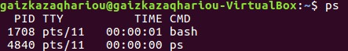
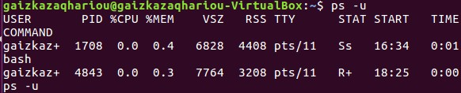
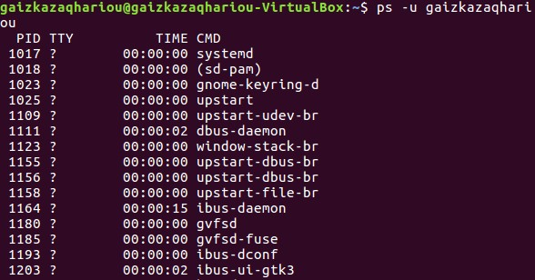
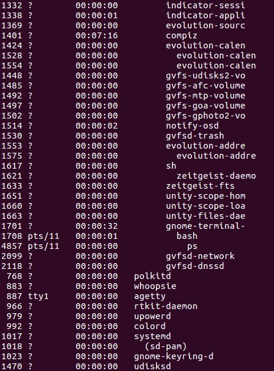
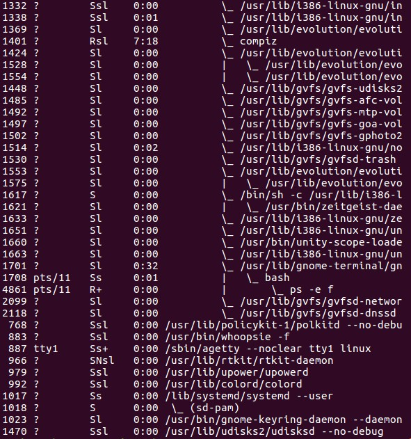
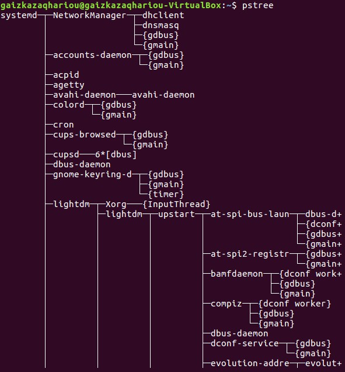
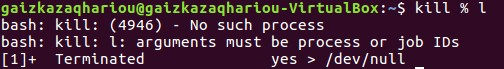

# Manajemen Proses 
Proses  adalah  sebuah  program  yang  sedang  dieksekusi.  Sedangkan  program  adalah  kumpulan 
instruksi yang ditulis ke dalam bahasa yang dimengerti sistem operasi. Sebuah proses membutuhkan 
sejumlah sumber daya untuk menyelesaikan tugasnya. Sumber daya tersebut dapat berupa CPU time, 
alamat  memori,  berkas-berkas,  dan  perangkat-perangkat  M/K.  Sistem  operasi  mengalokasikan 
sumber daya-sumber daya tersebut saat proses itu diciptakan atau sedang diproses/dijalankan. Ketika 
proses tersebut berhenti dijalankan, sistem operasi akan mengambil kembali semua sumber daya agar 
bisa digunakan kembali oleh proses lainnya. 

Sistem operasi bertanggung jawab atas aktivitas-aktivitas yang berkaitan dengan manajemen proses 
seperti:

* Membuat  dan  menghapus  proses  pengguna  dan  sistem  proses.  Sistem  operasi  bertugas 
mengalokasikan sumber daya yang dibutuhkan oleh sebuah proses dan kemudian mengambil 
sumber daya itu kembali setelah proses tersebut selesai agar dapat digunakan untuk proses 
lainnya. 
* Menunda atau melanjutkan proses. Sistem operasi akan mengatur proses apa yang harus 
dijalankan terlebih dahulu berdasarkan berdasarkan prioritas dari proses-proses yang ada. 
Apa bila terjadi 2 atau lebih proses yang mengantri untuk dijalankan, sistem operasi akan 
mendahulukan proses yang memiliki prioritas paling besar. 
* Menyediakan mekanisme untuk proses sinkronisasi. Sistem operasi akan mengatur jalannya 
beberapa proses yang dieksekusi bersamaan. Tujuannya adalah menghindarkan terjadinya 
inkonsistensi data karena pengaksesan data yang sama, juga untuk mengatur urutan jalannya 
proses agar setiap proses berjalan dengan lancar 
* Menyediakan  mekanisme  untuk  proses  komunikasi.  Sistem  operasi  menyediakan 
mekanisme agar beberapa proses dapat saling berinteraksi dan berkomunikasi (contohnya 
berbagi sumber daya antar proses) satu sama lain tanpa menyebabkan terganggunya proses 
lainnya. 
* Menyediakan  mekanisme  untuk  penanganan  deadlock.  Deadlock  adalah  kondisi  saling 
menunggu  untuk  mendapatkan  sumber  daya.  Sistem  operasi  harus  bisa  mencegah, 
menghindari,  dan  mendeteksi  adanya deadlock.  Jika deadlock  terjadi,  sistem  operasi  juga 
harus dapat memulihkan kondisi sistemnya. 

#####Ada empat konsep dasar pada manajemen proses, yaitu: 
1. `Multiprogramming`  merupakan  salah  satu  teknik  penjadwalan  dimana  suatu  proses  akan 
menggunakan CPU sampai proses tersebut beralih ke status wait (misalnya meminta I/O) atau selesai. 
Pada saat wait , maka CPU tidak sedang melakukan aktivitas atau nganggur (idle). Untuk mengatasi 
hal  ini,  maka  CPU  dialihkan  ke  proses  lain  pada  saat  suatu  proses  sedang  dalam  wait,  demikian 
seterusnya. 
2. `Pseudoparallelism` merupakan penggunaan lebih dari satu CPU untuk menjalankan sebuah program 
secara simultan. Idealnya, parallel processing membuat program berjalan lebih cepat karena semakin 
banyak CPU yang digunakan. 
3. `Multiprocessing`  merujuk  kepada  kemampuan  pemrosesan  komputer  yang  dilakukan  secara 
serentak.  Hal  ini  dimungkinkan  dengan  menggunakan  dua  CPU  atau  lebih  dalam  sebuah  sistem 
komputer. Istilah ini juga dapat merujuk kepada dukungan sebuah sistem untuk mendukung lebih dari 
satu prosesor dan mengalokasikan tugas kepada prosesor-prosesor tersebut.
4. `Distributed  Processing`  pada  konsep  manajemen  proses  ini  semua  proses  pengolahan  data 
dikerjakan secara bersama antara komputer pusat dengan beberapa komputer yang lebih kecil dan 
saling dihubungkan melalui jalur komunikasi. Setiap komputer tersebut memiliki prosesor mandiri 
sehingga  mampu  mengolah  sebagian  data  secara  terpisah,  kemudian  hasil  pengolahan  tadi 
digabungkan  menjadi  satu  penyelesaian total.  Jika  salah  satu  prosesor mengalami kegagalan  atau 
masalah yang lain akan mengambil alih tugasnya.

#####Manajemen Proses pada Sistem Operasi Linux 
Pada sistem operasi Linux, setiap program yang berjalan merupakan proses. Ketika sistem operasi 
pertama  kali  dijalankan,  saat  itu  proses  yang  bertanggung  jawab  untuk  memuat  (load)  Kernel 
diciptakan. Proses yang pertama kali diciptakan di Linux disebut init. Konsep proses di Linux memiliki 
kemiripan dengan konsep file permission  yang mana setiap user hanya dapat memanipulasi proses 
yang menjadi “milik” nya. Setiap proses memiliki Process ID (PID) yang merupakan nomor unik yang 
dapat digunakan untuk berinteraksi dengan proses yang bersangkutan. 

#####Tipe-tipe Proses dalam Linux 
Tipe-tipe proses dalam Linux, dibagi ke dalam 3 bagian, yaitu : 
1.  Interactive adalah Proses yang diprakarsai oleh sebuah shell dan berjalan dalam foreground dan 
background. seperti : terminal, software running, dll. 
2.  Batch adalah Sebuah seri dari proses-proses yang dijadwalkan untuk dieksekusi pada suatu 
waktu tertentu, proses batch ini juga tidak berhubungan dengan terminal, tapi menunggu 
dieksekusi secara sekuensial. 
3.  Daemon adalah Proses  yang  diinisialisasi  saat  booting   untuk  membentuk  suatu  fungsi-
fungsi sistem  yang  dibutuhkan,  bila  tidak  ada  request maka  akan  berada  pada  keadaan 
idle, seperti : LPD, NFS, dan DNS. 

#####Identitas Proses 
Berikut adalah beberapa identitas dari Proses yang ada di Linux : 
1. PID ( Proccess ID ) adalah pengenalan unik suatu proses, dimana digunakan untuk menentukan 
proses-proses mana yang di bawa saat suatu aplikasi dijalankan atau melakukan proses pengiriman 
signal, mengubah, dan menunggu proses lainnya. PID sendiri  merupakan bilangan 32 bit yang dibatasi 
oleh  Linux  dari  range  0-32767  untuk  menjamin  kompatibilitas  dengan  UNIX  tradisional. 
2. Credentials ( Mandat ) adalah Pengaturan akses yang dipengaruhi oleh User ID dan Group ID. Jadi 
kita dapat mengatur hak akses atau Credetials setiap user, group, dll. 
3. Personality adalah sebuah hal yang cukup jarang ditemukan dalam sistem UNIX, namun sangat 
berpengaruh dalam proses system call dan pengiriman signal dari suatu aplikasi.

#####Status Proses yang dikenali dalam Linux 
1. Task Running, yaitu proses yang siap untuk dieksekusi CPU 
2. Task Interruptable, yaitu proses yang menunggu sebuah kondisi. Interupsi, Sinyal dan aktifitas 
lain akan membangunkan proses. 
3. Task Uninterruptable, yaitu proses yang sedang sleep, dan tidak dapat di interrupt oleh signal. 
4. Task Stopped, yaitu proses yang dihentikan 
5. Task Zombie, yaitu proses telah berhenti, namun masih memiliki struktur data

###Perintah Manajemen Proses pada Linux 
Perintah inti dari proses manajemen proses di Linux adalah perintah ps dan kill. 

####Perintah ps 
Perintah atau command ps (process status) di gunakan untuk menampilkan informasi proses yang ada 
termasuk nomor PID (Process Identification Number) dari proses tersebut. Proses atau biasa disebut 
task akan berjalan jika ada sebuah aplikasi yang sedang dijalankan, setiap proses yang berjalan oleh 
system diberi nomor PID yang unik.  
Sebelum mempelajari dan mencoba menggunakan perintah-perintah ps untuk manajemen proses 
pada sistem operasi Linux, di bawah ini terdapat beberapa istilah mengenai output perintah ps : 
* `PI`  : nomor identitas unik untuk mengidentifikasi sebuah proses 
* `USER`  : pengguna yang merupakan pemilik proses 
* `TTY`  : nama terminal dimana proses tersebut aktif 
* `CMD`  : instruksi yang digunakan  
* `%CPU`  : persentase CPU time yang digunakan oleh proses tersebut 
* `%MEM` : persentase sistem memori yang digunakan proses 
* `VSZ`  : Virtual Size atau memori virtual yang digunakan pada proses 
* `RSS`  : Real System Storage yaitu jumlah memori yang sebenarnya  digunakan  
* `STAT`  : status proses tersebut apakah sedang dalam status S (sleeping), R (running) atau Z
   (Zombie) 
* `START`  : waktu dimana proses tersebut diaktifkan 
* `PR`  : angka prioritas proses  
* `NI`  : Nice Value yaitu nilai yang menunjukkan urutan prioritas suatu proses, semakin kecil 
  nilai NI maka proses tersebut semakin diprioritaskan 
* `VIRT`  : memory virtual yang digunakan oleh proses  
* `RES`  : memory fisik yang digunakan oleh proses 
* `SHR`  : proses yang disharing  
* `TIME+`  : total waktu untuk seluruh aktivitas proses  
 
 
* `$ ps` 
Perintah ps tanpa diikuti option apapun, akan menampilkan proses yang ada dengan output 
standart dari perintah ps.
 
 
* `$ ps u` 
Perintah ps u akan menampilkan proses yang ada beserta nama user yang memiliki proses 
tersebut juga disertai keterangan lainnya dari proses tersebut. 
 

* `$ ps –u (nama user)` 
Perintah ps -u (nama user) akan menampilkan secara spesifik proses yang ada berdasarkan 
pada user yang ditentukan. 
 
 
* `$ ps –a`
Perintah ps -a akan menampilkan proses yang sedang dieksekusi pada satu user yang sedang 
aktif. 
 

* `$ ps –au`
Perintah ps -au akan menampilkan proses yang sedang dieksekusi pada semua user. 
 

* `$ ps –eH`
Perintah  ps  -eH  akan  menampilkan  hubungan  proses  parent  dan  child.  Proses  child  akan 
muncul dibawah proses parent dan proses child ditandai dengan awalan beberapa spasi. Pada 
perintah ini opsi e digunakan untuk memilih semua proses dan opsi H untuk menghasilkan 
tampilan proses secara hierarki. 
 
 
* `$ ps –eF`
Perintah ps -eF akan menampilkan hubungan proses parent and child sama seperti perintah 
sebelumnya  tetapi  lengkap  dengan  keterangan  lain  dan  opsi  F  akan  menampilkan  status 
proses dengan karakter grafis (`\` dan `_`). 
 

* `$ pstree`
Perintah pstree akan menampilkan hubungan proses parent and child dalam hirarki seperti 
skema pohon yang bercabang. 
 

####Perintah kill 
Perintah  kill  adalah  salah  satu  perintah  dasar  Linux  yang  digunakan  untuk  menghentikan  atau 
mematikan proses yang sedang berjalan pada Sistem Operasi Linux / UNIX. Dengan perintah ini kita 
dapat menghentikan proses yang mengganggu performa atau proses yang tidak dibutuhkan, dll. 
* `$ kill %(nomor job)`
Untuk menghentikan job, gunakan perintah kill diikuti job  number atau PID proses. Untuk 
identifikasi job number, diikuti prefix dengan karakter `%`. contoh : `kill %1`
 
 
* `$ kill (PID)`
Perintah kill <PID> digunakan untuk menghentikan proses berdasarkan nomor PID prosesnya.

* `$ pkill (nama_proses)`
Perintah  pkill  (nama_proses)  digunakan  untuk  menghentikan  proses  berdasarkan  nama 
prosesnya. 

* `$ killall (nama_proses)`
Perintah  killall  (nama_proses)  digunakan  untuk  menghentikan  seluruh  proses  aplikasi 
berdasarkan nama prosesnya hingga ke bagian terdalam. 

* `$ renice (prioritas) (PID)`
Perintah  renice  (prioritas)  (PID)  digunakan  untuk  mengubah  prioritas  suatu  proses 
berdasarkan PID. Didalam sistem operasi Linux skala prioritasnya adalah -20 hingga 19. Skala 
paling kecil akan mendapatkan prioritas terbesar untuk mendapatkan tugas dan segera akan 
diproses. User biasa hanya memiliki hak untuk mengganti NI  menjadi lebih besar. Hanya root 
yang dapat mengganti nilai NI suatu PID menjadi lebih kecil.
